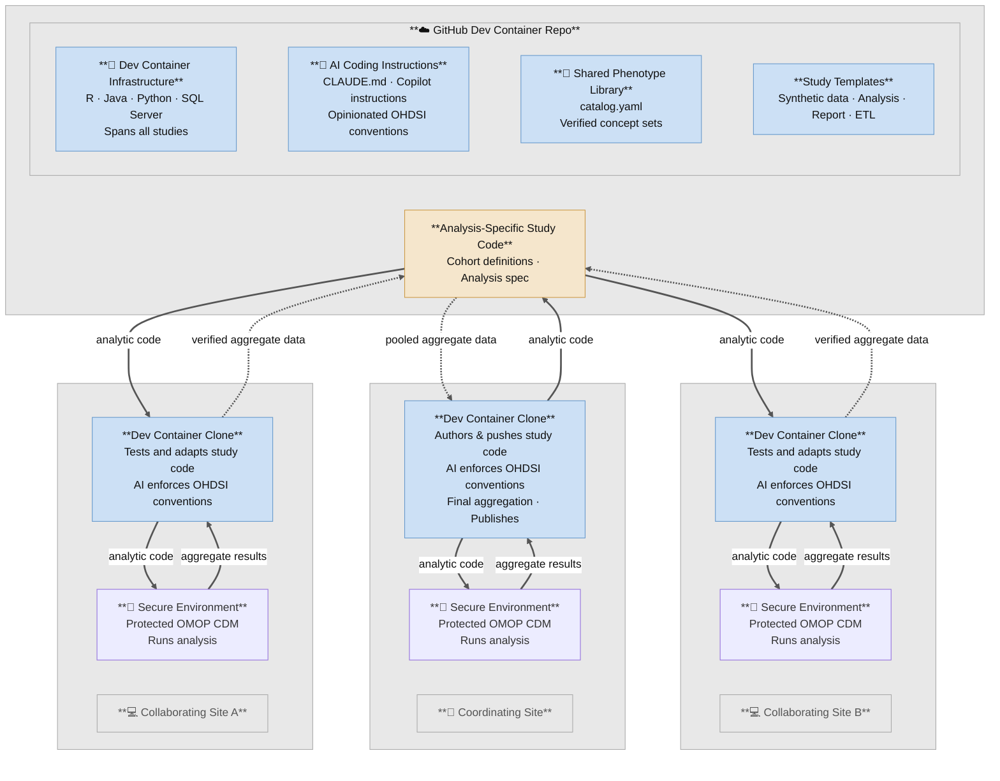

### charon 

**C**ontainerized **H**ADES **A**nalytics for **R**esearch in **O**HDSI **N**etworks.

[](https://doi.org/10.5281/zenodo.23189333)

## Is charon for me?

Use charon if you:

- analyze OMOP data with HADES;
- want investigators to develop safely against synthetic data;
- need identical analytic environments across collaborators;
- deploy analyses into restricted or air-gapped environments; or
- want patient-level data to stay at each institution while sharing analysis
  code and aggregate results.

charon is **not** a replacement for ATLAS, Strategus, HADES, or an OMOP ETL.
It provides the reproducible research workspace around them.

**What you get:** a pinned dev container (R, Java, Python and a SQL Server
database), a shared phenotype library of verified concept sets, a registry of
reusable synthetic datasets, templates for each kind of repo a study needs
(synthetic data, ETL, Strategus analysis, report), and AI-assistant rules that
enforce OHDSI conventions. Fork the repo or click **Use this template** to
stand up your lab's workspace.

> **Who this README is for:** readers who know OMOP/OHDSI basics, can read R
> and Python, and know roughly what Java is for here (JDBC), but nothing about
> this project. Project terms are in the [glossary](#glossary).

**Contents:**
[Why this approach](#what-problem-this-solves) ·
[The big picture](#the-big-picture) ·
[Glossary](#glossary) ·
[What a study looks like](#what-a-study-looks-like) ·
[What is in this repo](#what-is-in-this-repo) ·
[Rules](#rules-you-must-follow) ·
[Prerequisites](#prerequisites) ·
[Where to go next](#where-to-go-next) ·
[Use it for your lab](#using-charon-for-your-own-lab)

---

## What problem this solves

**The usual approach is aggregate first, analyze second:** pool patient-level
data from every site, then analyze. It is getting harder to sustain:

- **Data use agreements** take months to negotiate and repeat for every new
  study, partner or data element.
- **Stripped-down data.** De-identification and abstraction remove exact
  dates, detailed medication and lab histories, and linkage across encounters,
  and with them much of the EHR's analytic richness.
- **Bottlenecks.** Even within one institution, analyses queue behind a single
  abstraction and analysis team that builds a bespoke extract per question.

**charon supports federated analysis instead: the code travels and the data
stays put.** Each site keeps its OMOP data in its own secure environment; the
analysis is written once, shared, and run where the data lives; only aggregate
results come back. Patient-level data is never reduced before analysis.

**It also helps inside one institution.** Once EHR data is in OMOP, any trained
person there can draft and test an analysis against synthetic data, then run
the reviewed code in the secure environment, with no central abstraction team
needed for every study.

**It makes the analysis hypothesis-driven.** Because the code is written on
synthetic data, the team builds the cohorts, chooses the analytic strategy and
produces publication-ready tables and figures *before* seeing a real result.
The reviewed code is committed to git and run once; with nothing to peek at,
there is little room for p-hacking, and any later change is a visible,
reviewable deviation. Synthetic data shows the pipeline works, not what the
real effect is: report real-run findings as pre-specified or clearly labelled
post-hoc.

**What charon has to solve** to make that work:

1. **A safe place to write code.** Everything runs against synthetic OMOP data
   ([Synthea](https://github.com/synthetichealth/synthea)) in a local
   container, so shared repos never contain PHI.
2. **Code that runs where you cannot see it.** Secure environments are often
   air-gapped, so packages are pinned in `renv.lock` and each study builds a
   self-contained *bundle* with no network calls.
3. **Traceable results.** Code, cohorts and concept sets live in git; changes
   reach `main` only through reviewed PRs. (Git primer:
   [`docs/GETTING_STARTED.md`](docs/GETTING_STARTED.md#primer-git-github-cloning-and-vs-code).)
4. **Shared definitions.** A phenotype library and a mandatory concept-lookup
   order ([Rule 1](#rules-you-must-follow)) keep two analysts from picking
   different concept IDs for "heart failure".

## The big picture



Top: shared, PHI-free GitHub content. Middle: each site's dev container, where
code is tested on synthetic data. Bottom: each institution's secure
environment, where code goes in and only aggregate results come out. The
*coordinating site* authors the study and pools the aggregates (HADES
`EvidenceSynthesis`).

## Glossary

Project-specific terms (standard OHDSI terms are not repeated).

| Term | Meaning |
|---|---|
| **Workspace** | This repo, cloned onto your machine. It owns the shared SQL Server, vocabulary, dev container, phenotype library and AI rules. Study repos live *inside* it but are separate git repos. |
| **Dev container** | A Docker container (`.devcontainer/`) with R, Java, Python and HADES. You open the workspace in VS Code and your terminal runs inside it. |
| **`omop_synth` / `omop_vocab`** | The one SQL Server database your local studies share, and the schema in it holding the OMOP vocabulary (loaded once from Athena). |
| **Template / study repo** | A GitHub *template repository* you click **Use this template** on to create a study repo. Four kinds: see [What a study looks like](#what-a-study-looks-like). |
| **Bundle** | Study code plus pinned R packages and JDBC driver, packaged for transport into an air-gapped environment. |
| **Lookup tiers** | The mandatory order for finding a concept ID (OHDSI Phenotype Library → your lab's ATLAS definitions → local catalog → live query). See [Rule 1](#rules-you-must-follow). |
| **`[vocab query]` / `[pretraining]`** | Provenance labels on every concept ID: confirmed against your loaded vocabulary, or recalled from AI training data and **not trustworthy** until verified. |
| **Working branch** | Your personal git branch, named after your GitHub username. You never push to `main`. |

## What a study looks like

A study is **not one repo**. It is split by *audience*, because code that
mixes deployment scripts, report formatting and cohort logic gets copied
between studies and drifts. Each repo is created from a template.

| # | Role | Repo name | Create it from | Holds |
|---|---|---|---|---|
| 1 | Synth | `<study>-synth` | [`synthea-omop-template`](https://github.com/Duke-Vascular-Informatics/synthea-omop-template) | **Data generation only.** An analysis-specific Synthea disease module, plus generation → ETL → quality-check steps (`workflow/01–06`) producing one reusable synthetic CDM. Registered in `synthetic_data/registry.yaml`. **Optional** — only if no existing dataset fits. Contains no analysis. |
| 2 | Analysis-core | `<study>` | [`strategus-study-template`](https://github.com/Duke-Vascular-Informatics/strategus-study-template) | circe cohort JSON, the Strategus analysis spec, the extract step that writes result CSVs. No report code, no PHI. |
| 3 | Report toolkit | `omop-report-toolkit` | — (one shared package) | Generic table/figure helpers used by every report repo. |
| 3b | Report | `<study>-report` | [`omop-report-template`](https://github.com/Duke-Vascular-Informatics/omop-report-template) | One study's manuscript: which tables, which figures, the narrative. Reads analysis-core output only. **Every study gets one**, even a purely descriptive one. |
| 4 | Site-deploy | `<your-site>-deploy` | — (private, institution-specific) | Turns the bundle into something your secure environment can run: site config, handoff mechanism, credentials. The only place PHI-adjacent exports or site credentials may live. |

A fifth template, [`omop-etl-template`](https://github.com/Duke-Vascular-Informatics/omop-etl-template),
is separate from this pipeline: use it to convert a *real* registry or flat-file
source into OMOP CDM v5.4.

**The analysis always lives in the analysis-core (Strategus) repo, and the
manuscript in the report repo.** `synthea-omop-template` only generates
analysis-specific synthetic data; its `cohorts/` and `covariates/` exist solely
to check that the generated data contains the patients your study needs. The
split is deliberate: the analysis-core repo is what you hand to other
institutions, so nothing site- or report-specific may be in it, and the report
repo must run on a laptop with only a clone and a `results/` folder, so it
never imports `DatabaseConnector` (a query a report needs goes in the
analysis-core's `R/extract_report_inputs.R`).

`studies.yaml` registers every repo in your workspace, its bucket
(`pipeline_role`) and migration status; check it before assuming where code
lives.

### How the repos sit on disk

Study repos are cloned *inside* the workspace folder, as siblings:

```
my-workspace/                  ← this repo (infrastructure)
├── .env                       ← your secrets (gitignored)
├── omop_vocab/                ← Athena vocabulary CSVs (gitignored)
├── my-study/                  ← analysis-core repo (own git remote)
│   └── output/                ← result files; the report repo reads these
└── my-study-report/           ← report repo (sibling, never nested)
```

Add study repos to the workspace `.gitignore` and register them in `studies.yaml`.

## What is in this repo

```
charon/
├── docker-compose.yml          # Shared SQL Server container (container name: mssql_dev)
├── .devcontainer/              # Dev container: Dockerfile, compose overlay, VS Code config
├── renv.lock                   # Workspace-wide R package lockfile (HADES + tidyverse)
├── .Rprofile                   # Activates renv; loads .env (real environment wins over .env)
├── .env.example                # Template for your secrets file
│
├── CLAUDE.md                   # Rules for AI assistants — read it, it applies to you too
├── .github/                    # Copilot instructions (same rules, Copilot format)
│
├── studies.yaml                # Registry of your study repos (placeholder content)
├── contributors.yaml           # Contributors and CRediT roles (placeholder)
├── WORKSPACE_ROSTER.md         # Your repos and repo-specific rules (placeholder)
│
├── docs/                       # Onboarding and reference docs — start at docs/GETTING_STARTED.md
├── infrastructure/             # One-time setup: vocabulary loader, host bootstrap scripts
├── scripts/                    # Workspace utilities + charon sync tooling
├── phenotype_library/          # Verified concept-set catalog + lookup scripts
├── synthetic_data/             # Synthetic dataset registry + export/import scripts
├── osf/                        # Registry and scripts for hosting protocols on OSF (private)
│
├── synthea-omop-template/      # submodule → bucket 1 (-synth repos; synthetic data generation only)
├── omop-etl-template/          # submodule → real-source-to-OMOP ETL
├── strategus-study-template/   # submodule → bucket 2 (analysis-core; all analysis)
└── omop-report-template/       # submodule → bucket 3b (report repo)
```

The SQL Server container (`mssql_dev`) and the dev container start together on
one Docker network; inside the container the database host is `mssql_dev`, not
`localhost`. The workspace `renv.lock` (HADES + tidyverse) is restored when the
container builds.

**Match the toolchain to your secure environment.** Code developed here must run
there, so the container's **R, Java and Python versions must match** it. The
defaults (R 4.5.2, Java 17, Python 3.12) are not necessarily yours: before your
first build, set `R_VERSION`, `JAVA_VERSION` and `PYTHON_VERSION` in `.env`, and
reconcile `renv.lock` if R changes. Steps:
[`docs/GETTING_STARTED.md` → Step 6.0](docs/GETTING_STARTED.md#60-match-the-container-to-your-secure-environment-before-the-first-build).

**Two-level renv.** The workspace `renv.lock` holds everything shared; a study
repo's `renv.lock` holds only what that study needs beyond it (usually
nothing). Add reusable packages at the workspace level first, via a PR here.

## Rules you must follow

Enforced for AI assistants by `CLAUDE.md` and equally binding on humans; read
`CLAUDE.md` before your first change.

1. **Concept-ID transparency.** Never write a concept ID into code, SQL or a CSV
   until you have checked, in order: (1a) OHDSI Phenotype Library, (1b) your
   lab's label-prefixed ATLAS definitions (authoritative), (2) the local
   `phenotype_library/catalog.yaml`, then (3) a live vocabulary query. Tag every
   ID `[vocab query]` or `[pretraining]`; only the former may be committed.
   Remembered IDs, including an AI's, have been wrong in this vocabulary.
2. **Package priority.** HADES first, tidyverse second, anything else only from
   the project CRAN mirror. No `dbplyr`, `odbc` or direct `DBI`: use
   `DatabaseConnector` and `SqlRender`.
3. **Verbose OHDSI-style comments**, including a trailing comment on every
   hard-coded concept ID naming the concept and its provenance label.
4. **Branching.** Work on your own branch (your GitHub username); PRs into
   `main`, squash-merge, owner approval required. Never push to `main` or
   another person's branch.
5. **No PHI, no secrets.** Only aggregate output; never commit `.env`,
   `omop_vocab/` or anything from a secure environment.
6. **OSF stays private** until a person releases it manually.

## Prerequisites

Before first-time setup you need: a GitHub account (its username becomes your
branch name), Git, Docker Desktop 4.x+, VS Code with the *Dev Containers*
extension, a free Athena account (to download the OMOP vocabulary), optionally a
free UMLS account (only to rebuild CPT-4), and **the R, Java and Python versions
of your secure analytics environment** (see above).

Hardware: ~**35 GB** disk in use (Docker disk limit **60–80 GB**) and **16 GB
RAM** for Docker (12 GB minimum; the vocabulary load is killed silently below
that). Claude Code installs itself in the container; add an Anthropic API key in
`.env`.

## Where to go next

Follow these in order:

| Step | Read | You will |
|---|---|---|
| 1 | [`docs/GETTING_STARTED.md`](docs/GETTING_STARTED.md) | Install tools, build the container, load the vocabulary, create your first study repos |
| 2 | [`docs/ANALYST_PLAYBOOK.md`](docs/ANALYST_PLAYBOOK.md) | Learn the day-to-day loop and where to look when something breaks |
| 3 | [`docs/COMMANDS.md`](docs/COMMANDS.md) | Keep as the command cheat sheet |
| 4 | [`phenotype_library/README.md`](phenotype_library/README.md) | Learn the concept lookup workflow before defining cohorts |
| 5 | The README of the template for the repo you are creating | Learn that template's own steps |

Other references: [`docs/SETUP.md`](docs/SETUP.md) (infrastructure details),
[`docs/GIT_GITHUB_AUTH.md`](docs/GIT_GITHUB_AUTH.md) (SSH/token auth),
[`synthetic_data/README.md`](synthetic_data/README.md) (reusing synthetic
datasets), [`docs/MAINTAINER_PLAYBOOK.md`](docs/MAINTAINER_PLAYBOOK.md)
(governance, if you maintain the workspace).

## Using charon for your own lab

Click **Use this template** (or clone), then replace the placeholder instance
data — every file already exists under its real name with one illustrative
entry and inline schema comments:

- `studies.yaml` — your study/report/synth/ETL repo registry
- `contributors.yaml` — your contributors (regenerate `CONTRIBUTORS.md` with `Rscript scripts/sync_contributors.R`)
- `phenotype_library/catalog.yaml` — your verified concept sets
- `osf/osf_projects.csv`, `osf/osf_files.csv` — your OSF protocol registry
- `synthetic_data/registry.yaml` — your synthetic dataset registry
- `WORKSPACE_ROSTER.md` — your repo layout and repo-specific rules
- `CITATION.cff` — your authors and repo URL

Everything else — `scripts/`, the lookup scripts, the four template
submodules, the dev container, and the generic rules in `CLAUDE.md` — is
infrastructure; keep it as is.

### Staying in sync with charon

To keep receiving infrastructure fixes after you diverge, add this repo as a
second remote and use the sync scripts. No shared git history is required:

```bash
git remote add charon https://github.com/Duke-Vascular-Informatics/charon.git
scripts/pull_charon_updates.sh                  # bring charon's infra fixes into your workspace
scripts/push_charon_updates.sh -m "<message>"   # contribute a fix back upstream
```

Both read `scripts/charon_manifest.txt` for the shared paths. Your lab's own
data (`studies.yaml`, `contributors.yaml`, the catalog, the roster, the OSF
registries) is excluded and never touched. Contributing guidelines are in
[`docs/MAINTAINER_PLAYBOOK.md`](docs/MAINTAINER_PLAYBOOK.md).

---

## Citing

If you use charon, please cite it — see [`CITATION.cff`](CITATION.cff) (GitHub's
**Cite this repository** button reads it). The DOI badge above,
[10.5281/zenodo.23189333](https://doi.org/10.5281/zenodo.23189333), always
resolves to the latest release; each release also has its own version DOI on
[Zenodo](https://doi.org/10.5281/zenodo.23189333), which is the one to cite when
reproducibility of a specific version matters (v1.0.0:
[10.5281/zenodo.23189334](https://doi.org/10.5281/zenodo.23189334)).

---

## Funding

The original development of this codebase (as this lab's own workspace,
before it was split into this reusable template) was supported by the
National Center For Advancing Translational Sciences of the National
Institutes of Health under Award Number K12TR005435. The content is solely
the responsibility of the authors and does not necessarily represent the
official views of the National Institutes of Health.

---

## License

Copyright 2026 Duke University. All Rights Reserved. The software is hereby licensed under the GNU GPL License v2 (see [LICENSE](LICENSE)). Study repositories and templates built from this workspace are likewise encouraged to license under GNU GPL v2. OMOP vocabulary files are subject to the [Athena license terms](https://www.ohdsi.org/analytic-tools/athena-standardized-vocabularies/).

This workspace's development and CI environments depend on
[Synthea](https://github.com/synthetichealth/synthea) (Copyright 2017-2025 The MITRE
Corporation) to generate synthetic patient data with no PHI. Synthea is an independently
developed, open-source project distributed under its own **Apache License 2.0** — a
separate license from this workspace's GPL v2, not a GPL v2 dependency. It is vendored,
with its own `LICENSE` and `NOTICE` preserved unmodified, in
`synthea-omop-template/external/synthea/`. Synthea is not affiliated with Duke
University; see the upstream project for its own terms, attribution requirements, and
citation.

### Third-party vocabulary content

The OMOP Standardized Vocabularies (loaded into a shared `omop_vocab` schema via
OHDSI Athena, per the [Athena license terms](https://www.ohdsi.org/analytic-tools/athena-standardized-vocabularies/)
above) bundle several independently owned terminologies. **No vocabulary data file is
ever distributed with this code** — each user obtains their own Athena download and
loads it locally (see `docs/SETUP.md`); repos here only reference individual
concept IDs, codes, and names.

- **SNOMED CT** — source vocabulary for most condition/procedure concepts. Maintained
  by [SNOMED International](https://www.snomed.org/snomed-ct/get-snomed-ct); use
  requires an affiliate license (satisfied in the US via the National Library of
  Medicine's national affiliate license).
- **LOINC** — used for lab values and functional-status/frailty assessment items.
  Maintained by Regenstrief Institute, Inc. and the LOINC Committee. LOINC's license
  requires including this notice wherever LOINC content is incorporated: *"This
  material contains content from LOINC (http://loinc.org). LOINC is copyright ©
  Regenstrief Institute, Inc. and the Logical Observation Identifiers Names and Codes
  (LOINC) Committee and is available at no cost under the license at
  http://loinc.org/license. LOINC® is a registered United States trademark of
  Regenstrief Institute, Inc."*
- **RxNorm** — used for medications. Maintained by the National Library of Medicine;
  public domain.
- **ATC** (Anatomical Therapeutic Chemical Classification) — used for drug
  classification. Maintained by the WHO Collaborating Centre for Drug Statistics
  Methodology.
- **CPT4 / HCPCS** — used for procedure concepts in some cohort definitions. CPT4 is
  proprietary, maintained by the American Medical Association; HCPCS Level II is
  maintained by CMS. If your studies use CPT4/HCPCS-coded procedures, document that
  reliance in your own workspace's README/NOTICE, the way a downstream repo built on
  this template would.

> This section is a practical summary, not legal advice. For legal interpretation,
> consult your organization's counsel.

---

## Acknowledgments

- The four template submodules this repo scaffolds from —
  `synthea-omop-template`, `omop-etl-template`, `strategus-study-template`,
  `omop-report-template` — and the broader [OHDSI](https://www.ohdsi.org/)
  / [HADES](https://ohdsi.github.io/Hades/) ecosystem this workspace builds on.

### Early testers

Thanks to the following people for early testing and feedback that shaped
charon, ahead of its public release — they did not contribute code directly,
but their input improved the software:

Ayman Ali, Sasank Kalipatnapu, Shoaib Siddiqui, Junette Yu, Kyle Ge,
Evan Minty, Leila Mureebe, Logan Couce.
