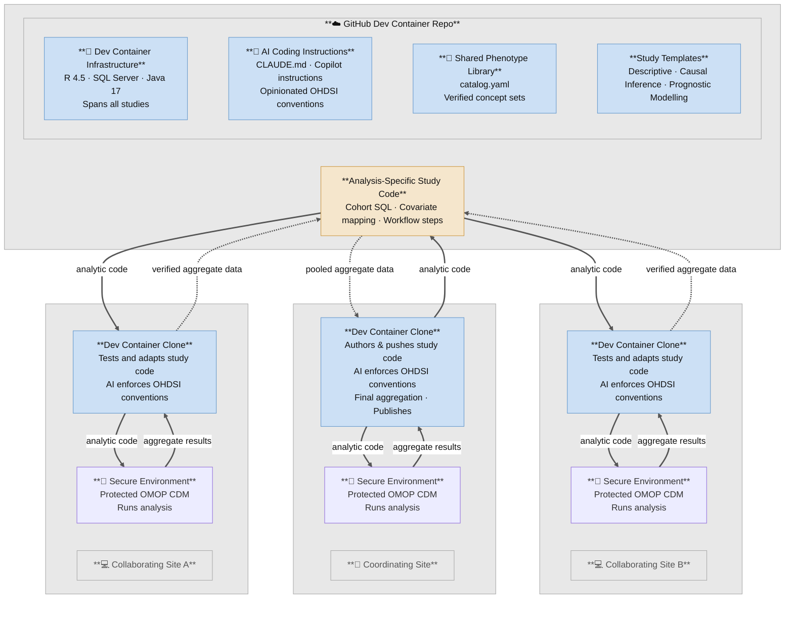

# Charon

**Containerized HADES Analytics for Research in OHDSI Networks.**

A reusable scaffold for OMOP CDM observational studies: a pre-configured dev
container (SQL Server, R 4.5, Java 17), a shared phenotype library, a
multi-repo analysis pipeline convention, and AI-assistant coding rules for
the OHDSI HADES R toolstack. Fork it, or click **Use this template**, to
stand up your own lab's workspace.

A study is not necessarily one repo. See
[**Multi-Repo Analysis Pipeline**](#multi-repo-analysis-pipeline) below for
how a study's analysis core, manuscript report, and deployment machinery
split across repos, and which template each one starts from.

---

## Getting your own copy

Click **Use this template** on this repo (or clone it directly), then
replace the placeholder instance data with your own — nothing to delete or
rename, every file already exists under its real name with one illustrative
entry and inline schema comments:

- `studies.yaml` — your study/report/synth/ETL repo registry
- `contributors.yaml` — your contributor list (regenerate `CONTRIBUTORS.md` with `Rscript scripts/sync_contributors.R` after editing)
- `phenotype_library/catalog.yaml` — your verified concept sets
- `osf/osf_projects.csv` / `osf/osf_files.csv` — your OSF protocol hosting registry
- `synthetic_data/registry.yaml` — your reusable synthetic dataset registry
- `WORKSPACE_ROSTER.md` — your repo layout and any repo-specific rules
- `CITATION.cff` — update the authors/repo-URL fields with your own

Everything else — `scripts/`, `phenotype_library/scripts/`,
`synthetic_data/scripts/`, the four `*-template` submodules, the
devcontainer, and `CLAUDE.md`'s generic conventions (Rules 1-3, branch
strategy, language/runtime, security) — is infrastructure, kept as-is.

### Staying in sync with charon

If you want to keep pulling infra fixes made here after you've started your
own workspace from this template, add this repo as a second remote and use
the included sync scripts — no shared git history or merge required:

```bash
git remote add charon https://github.com/Duke-Vascular-Informatics/charon.git
scripts/pull_charon_updates.sh    # bring charon's infra fixes into your workspace
scripts/push_charon_updates.sh -m "<message>"   # contribute a fix back upstream
```

Both scripts read `scripts/charon_manifest.txt` for the list of shared-infra
paths — your own lab's data (`studies.yaml`, `contributors.yaml`, the
phenotype catalog, `WORKSPACE_ROSTER.md`, OSF registries) is deliberately
excluded and never touched by either script.

---

## Federated Analysis Strategy

This workspace is designed for **federated observational research**: analytic code is developed in a shared, open environment using synthetic data, then transported into each institution's secure environment where it runs against real patient data. No patient data ever leaves the institution.



**Key properties of this design:**

| Property | How it is achieved |
|---|---|
| No PHI in central repo | Dev & CI always run against Synthea synthetic data |
| Reproducible environments | Dev container pinned via `renv.lock` and `Dockerfile` |
| Portable to air-gapped sites | `workflow/09` builds a self-contained bundle with no live dependencies |
| Shared concept sets | `phenotype_library/catalog.yaml` distributes verified concept IDs to all sites |
| Shared synthetic datasets | `synthetic_data/registry.yaml` lets studies reuse a disease/procedure/outcome-specific dataset without redistributing vocabulary |
| Multi-site synthesis | Each site returns only aggregate statistics; `EvidenceSynthesis` combines them |

---

## Multi-Repo Analysis Pipeline

A study answering one research question is split across up to four
independent repos, not authored in one. Each split repo has a **template**
you scaffold it from — the same relationship this workspace has with
`synthea-omop-template`, generalized. See
[`docs/MIGRATION_PLAN_REPO_SPLIT.md`](docs/MIGRATION_PLAN_REPO_SPLIT.md) for
the full rationale (in short: deployment machinery and report code copied
into every study repo drift, and fixing the same bug five times is how that
was discovered).

| # | Role | Repo name | Template | Contents |
|---|---|---|---|---|
| 1 | synth | `<study>-synth` | `synthea-omop-template` | Synthea module + Steps 1–6 only, for one reusable synthetic OMOP CDM dataset. Registered in `synthetic_data/registry.yaml`. Never answers a research question. |
| 2 | analysis-core | `<study>` | [`strategus-study-template`](https://github.com/Duke-Vascular-Informatics/strategus-study-template) (current) or `synthea-omop-template` (legacy) | Cohorts, analysis spec, the extract layer that turns CDM queries into result CSVs. Must be shareable with any institution — no report code, no PHI. |
| 3 | report-toolkit | `<your-org>-report-toolkit` | — (singleton, not scaffolded per-study) | Generic figure/table helpers shared across every report repo. Nothing study-specific. |
| 3b | report-repo | `<study>-report` | [`omop-report-template`](https://github.com/Duke-Vascular-Informatics/omop-report-template) | One study's Word manuscript composition — which tables, which figures, the narrative — rendered from bucket 2's result artifacts only. No database, no VPN, no credentials. |
| 4 | site-deploy | `<your-site>-deploy` | — (not on GitHub; typically a private, institution-hosted repo) | Bundle builder and site-specific deployment config. |

**Which template for a new study's analysis core?** Use
`strategus-study-template` unless the study needs the numbered
`workflow/01–09` scaffold (Synthea generation + ETL + QC in the same repo as
the analysis) — that path is legacy, kept for studies already built on it and
for the `-synth` convention. See `strategus-study-template`'s own README for
the two-path decision in more detail.

**Every new study also gets a report repo.** Even a purely descriptive study
that will only ever produce tables and figures for a manuscript should create
its `<study>-report` from `omop-report-template` rather than importing
`ggplot2`/`officer`/`flextable` into the analysis-core repo — that coupling
is exactly what the bucket 2 / bucket 3b split exists to prevent. See
`omop-report-template`'s README and `CHECKLIST.md`.

`studies.yaml` is the source of truth for which bucket every repo in this
workspace currently occupies, and how far each one has migrated (`migration:`
field per entry) — check there before assuming a given study's report or
deploy code has already moved to its own repo.

---

## Workspace Structure

```
charon/
├── docker-compose.yml          # Shared SQL Server container (Azure SQL Edge)
├── .devcontainer/               # VS Code dev container definition
│   ├── devcontainer.json
│   ├── docker-compose.yml      # Dev container service + volume mounts
│   ├── Dockerfile              # R 4.5.2 + Java 17 + system dependencies
│   └── setup-claude-headless.sh  # Claude Code headless auth bootstrap
├── renv.lock                   # Workspace-level R package lockfile (full HADES + tidyverse stack)
├── renv/activate.R             # renv bootstrap — sourced by .Rprofile on container start
├── .Rprofile                   # Activates workspace renv so all /workspace Rscript calls find packages
├── .env.example                # Template for local secrets (SQL Server password)
│
├── studies.yaml                 # Registry of all study and ETL repos in this workspace (placeholder)
├── contributors.yaml             # Contributor identity and CRediT roles (placeholder)
├── WORKSPACE_ROSTER.md          # Repo layout and repo-specific rules (placeholder)
│
├── docs/                        # Workspace-level setup guides and reference docs
├── scripts/                     # Workspace-level utility scripts + charon sync tooling
├── infrastructure/               # Workspace-level setup and vocabulary loader scripts
│   ├── setup/
│   └── scripts/
├── phenotype_library/            # Shared verified concept sets (catalog.yaml + lookup scripts, placeholder)
├── synthetic_data/               # Shared synthetic OMOP CDM dataset registry (placeholder)
├── osf/                          # OSF protocol hosting registry + sync scripts (placeholder)
│
├── synthea-omop-template/        # Legacy study template (git submodule) — workflow/01-09, still current for -synth repos
├── omop-etl-template/            # ETL template — copy this for each new registry data source (git submodule)
├── strategus-study-template/     # Strategus/circe analysis-core template (git submodule)
└── omop-report-template/         # Bucket 3b report-repo template (git submodule)
```

> Study, report, and synth repos beyond the four submodules are NOT part of
> this repo — they are independent repositories you create per study and
> gitignore from this one. See `studies.yaml` for the registry.

---

## How It Works

This workspace separates **shared infrastructure** from **study-specific code**:

| Layer | Lives in | Purpose |
|---|---|---|
| SQL Server database | `docker-compose.yml` + `.env` | One shared database for all studies |
| OMOP vocabulary | `omop_vocab/` (not committed) | Loaded once; shared across all studies |
| Dev container (R + Java) | `.devcontainer/` | Consistent R environment per study |
| R packages (workspace) | `renv.lock` + `renv/activate.R` | Full HADES + tidyverse stack; restored on container build so infrastructure scripts work from `/workspace` without needing to cd into a study subfolder |
| Study code | `synthea-omop-template/` (or other study repos) | Analysis logic, cohorts, parameters |

When you open the workspace in VS Code Dev Containers, both the SQL Server service and the dev container service start together. The study repo runs inside the dev container and connects to the shared SQL Server over the internal Docker network.

---

## Relationship with a Study Repo

A study repo lives inside this workspace folder as a sibling clone, and the
workspace provides the SQL Server and environment while the study repo
provides the science. Which template it's built from depends on the
analysis-core path (see [Multi-Repo Analysis Pipeline](#multi-repo-analysis-pipeline)
above):

**[`strategus-study-template`](https://github.com/Duke-Vascular-Informatics/strategus-study-template) (current, for new studies)** —
declarative circe cohort definitions executed by OHDSI Strategus:

- `inst/cohorts/*.json` — circe cohort expressions
- `CreateStrategusAnalysisSpecification.R` — builds the analysis spec
- `StrategusCodeToRun.R` — runs it against the CDM
- `config.R` / `study_params.yaml` — optional and minimal; most studies need neither

**[`synthea-omop-template`](https://github.com/Duke-Vascular-Informatics/synthea-omop-template) (legacy, still current for `-synth` repos)** —
imperative R + numbered workflow steps:

- `study_params.yaml` — study identity, cohort definitions, concept IDs, analysis flags
- `config.R` — reads `study_params.yaml` and merges with infrastructure defaults (do not edit directly)
- `cohorts/` — SQL cohort definitions (target, comparator, outcome)
- `covariates/` — covariate concept lists
- `R/` — analysis pipeline scripts
- `workflow/` — ordered execution steps (Steps 1–6 are also what a `-synth` repo keeps)
- `synthea/` — Synthea synthetic data generation and ETL

Either way, the manuscript report is a **separate sibling repo** built from
[`omop-report-template`](https://github.com/Duke-Vascular-Informatics/omop-report-template) —
see the Multi-Repo Analysis Pipeline section above. It is not part of either
template above.

```
charon/                               ← you are here (infrastructure)
├── <study>/                        ← analysis-core repo (plugs in here)
│   ├── inst/cohorts/  or  cohorts/ ← depending on template
│   ├── R/
│   └── output/                     ← result artifacts <study>-report reads
└── <study>-report/                  ← report repo (sibling, not nested)
    ├── GenerateReport.R
    └── R/
```

---

## Prerequisites

Complete in this order — each item is a prerequisite for the next:

| # | What | Install / register |
|---|------|--------------------|
| 1 | **GitHub account** | [github.com](https://github.com) — free |
| 2 | **Git** | [git-scm.com/downloads](https://git-scm.com/downloads) |
| 3 | **Docker Desktop** (v4.x+) | [docker.com/products/docker-desktop](https://www.docker.com/products/docker-desktop/) |
| 4 | **VS Code** + Dev Containers extension | [code.visualstudio.com](https://code.visualstudio.com/) — then install `ms-vscode-remote.remote-containers` |

> **AI coding assistant (Claude Code):** installs automatically inside the dev container.

Additional requirements:
- ~80 GB free disk space (SQL Server + OMOP vocabulary + R packages + Docker build cache)
- 16 GB RAM recommended (set in Docker Desktop → Settings → Resources → Advanced)

---

## Recommended Workflow (Workspace-First)

> **New? Follow [`docs/GETTING_STARTED.md`](docs/GETTING_STARTED.md) in order.** Do not run any command below until all prerequisites are installed.

Use this workflow for all new studies:

1. Create a GitHub account and Personal Access Token
2. Install Git, Docker Desktop, and VS Code (with Dev Containers extension and AI assistant)
3. Use this template (or clone it) to create your own workspace repo
4. Configure `.env` (SQL password + GitHub token)
5. Open in the VS Code dev container
6. Download and load the OMOP vocabulary (one-time per machine)
7. Clone your study repo as a subfolder and run study-specific workflows

Example layout:

```
my-omop-dev-workspace/
    .env
    docker-compose.yml
    omop_vocab/
    synthea-omop-template/        # Template/reference repo
    my-study-a/              # Project repo
    my-study-b/              # Project repo
```

---

## Getting Started

**For full step-by-step instructions, follow [`docs/GETTING_STARTED.md`](docs/GETTING_STARTED.md).**

It covers everything from GitHub account creation through vocabulary load and study execution, with plain-language explanations for each step. The summary below is for returning users who already have the workspace set up.

| Phase | Steps | Detail |
|---|---|---|
| **First-time machine setup** | GitHub account → Git → Docker Desktop → VS Code → clone → `.env` → open container | [`docs/GETTING_STARTED.md`](docs/GETTING_STARTED.md) Steps 1–7 |
| **Vocabulary (one-time per machine)** | Download from Athena → load into SQL Server | Steps 8–9 |
| **Each new study** | Create study repo → define cohort/covariates → ETL → analysis → bundle | Steps 10–11 |

---

## Working with Multiple Study Repositories

- Keep each study as its own git repository under the workspace root.
- Treat this repository as infrastructure orchestration, not a study code repo.
- Add independent study repos to this workspace repo's `.gitignore` when needed.
- Run commands from the target study folder, while reusing the same shared SQL Server and vocabulary.
- **Two-level renv architecture — do not duplicate packages across levels:**

  | Level | File | What belongs here |
  |---|---|---|
  | **Workspace** (`renv.lock`, this repo's root) | Source of truth for all shared packages | HADES analysis stack (CohortMethod, CohortDiagnostics, CohortGenerator, EmpiricalCalibration, PatientLevelPrediction, FeatureExtraction, ResultModelManager, etc.), tidyverse, reporting deps (flextable, officer, ragg, osfr), database/ETL infrastructure (DatabaseConnector, SqlRender, Achilles, DataQualityDashboard, ETLSyntheaBuilder), and all their transitive dependencies |
  | **Study repo** (`<study>/renv.lock`) | Study-specific additions only | Packages genuinely not present in the workspace lockfile that are required by that study's analysis code. Should be a small delta — most studies add nothing. |

  If a package is already in the workspace `renv.lock`, **do not add it to a study repo's lockfile**.

  When a study genuinely needs a new package:
  1. Add it at the **workspace level** first: open a PR against this repo with `renv::install()` + `renv::snapshot()` run from the workspace root.
  2. If it is truly study-specific (not reusable), add it to the study lockfile and note the rationale in the PR description.

## AI Assistant Instructions (Shared)

Shared assistant guidance for all study subfolders is centralized at workspace root:

- `CLAUDE.md`
- `.github/copilot-instructions.md`
- `.github/instructions/omop-ohdsi.instructions.md`
- `.github/instructions/r-packages.instructions.md`

Keep only analysis-specific overrides in each study subfolder.

---

## Adding a New Study

1. Clone an analysis-core study repo — created from `strategus-study-template`
   for a new study, or `synthea-omop-template` only if it needs the numbered
   `workflow/01–09` scaffold — into this workspace folder
2. Clone a matching `<study>-report` repo, created from `omop-report-template`,
   as a sibling of it — every study gets one, even a purely descriptive study
   with no risk score (see Multi-Repo Analysis Pipeline above)
3. Add both to `.gitignore` if they should remain independent from this workspace repo
4. Open the workspace in the dev container — SQL Server is already running and shared
5. If a repo adds packages beyond the workspace `renv.lock`, run `renv::snapshot()` inside that repo's folder, then copy the lockfile to the workspace root
6. Register both repos in `studies.yaml`

---

## macOS / Apple Silicon Notes

The SQL Server image (`mcr.microsoft.com/azure-sql-edge`) provides native ARM64 support for Apple Silicon Macs. The dev container handles all Docker and SQL Server setup automatically — see [`docs/GETTING_STARTED.md`](docs/GETTING_STARTED.md) for the full setup sequence.

---

## Contributing

See [`docs/MAINTAINER_PLAYBOOK.md`](docs/MAINTAINER_PLAYBOOK.md) for the
governance process, and `scripts/push_charon_updates.sh` if you're
contributing an infra fix back from a workspace built on this template.

---

## Funding

The original development of this codebase (as this lab's own workspace,
before it was split into this reusable template) was supported by the
National Center For Advancing Translational Sciences of the National
Institutes of Health under Award Number K12TR005435. The content is solely
the responsibility of the authors and does not necessarily represent the
official views of the National Institutes of Health.

---

## License

Copyright 2026 Duke University. All Rights Reserved. The software is hereby licensed under the GNU GPL License v2 (see [LICENSE](LICENSE)). Study repositories and templates built from this workspace are likewise encouraged to license under GNU GPL v2. OMOP vocabulary files are subject to the [Athena license terms](https://www.ohdsi.org/analytic-tools/athena-standardized-vocabularies/).

This workspace's development and CI environments depend on
[Synthea](https://github.com/synthetichealth/synthea) (Copyright 2017-2025 The MITRE
Corporation) to generate synthetic patient data with no PHI. Synthea is an independently
developed, open-source project distributed under its own **Apache License 2.0** — a
separate license from this workspace's GPL v2, not a GPL v2 dependency. It is vendored,
with its own `LICENSE` and `NOTICE` preserved unmodified, in
`synthea-omop-template/external/synthea/`. Synthea is not affiliated with Duke
University; see the upstream project for its own terms, attribution requirements, and
citation.

### Third-party vocabulary content

The OMOP Standardized Vocabularies (loaded into a shared `omop_vocab` schema via
OHDSI Athena, per the [Athena license terms](https://www.ohdsi.org/analytic-tools/athena-standardized-vocabularies/)
above) bundle several independently owned terminologies. **No vocabulary data file is
ever distributed with this code** — each user obtains their own Athena download and
loads it locally (see `docs/SETUP.md`); repos here only reference individual
concept IDs, codes, and names.

- **SNOMED CT** — source vocabulary for most condition/procedure concepts. Maintained
  by [SNOMED International](https://www.snomed.org/snomed-ct/get-snomed-ct); use
  requires an affiliate license (satisfied in the US via the National Library of
  Medicine's national affiliate license).
- **LOINC** — used for lab values and functional-status/frailty assessment items.
  Maintained by Regenstrief Institute, Inc. and the LOINC Committee. LOINC's license
  requires including this notice wherever LOINC content is incorporated: *"This
  material contains content from LOINC (http://loinc.org). LOINC is copyright ©
  Regenstrief Institute, Inc. and the Logical Observation Identifiers Names and Codes
  (LOINC) Committee and is available at no cost under the license at
  http://loinc.org/license. LOINC® is a registered United States trademark of
  Regenstrief Institute, Inc."*
- **RxNorm** — used for medications. Maintained by the National Library of Medicine;
  public domain.
- **ATC** (Anatomical Therapeutic Chemical Classification) — used for drug
  classification. Maintained by the WHO Collaborating Centre for Drug Statistics
  Methodology.
- **CPT4 / HCPCS** — used for procedure concepts in some cohort definitions. CPT4 is
  proprietary, maintained by the American Medical Association; HCPCS Level II is
  maintained by CMS. If your studies use CPT4/HCPCS-coded procedures, document that
  reliance in your own workspace's README/NOTICE, the way a downstream repo built on
  this template would.

> This section is a practical summary, not legal advice. For legal interpretation,
> consult your organization's counsel.

---

## Acknowledgments

- The four template submodules this repo scaffolds from —
  `synthea-omop-template`, `omop-etl-template`, `strategus-study-template`,
  `omop-report-template` — and the broader [OHDSI](https://www.ohdsi.org/)
  / [HADES](https://ohdsi.github.io/Hades/) ecosystem this workspace builds on.

### Early testers

Thanks to the following people for early testing and feedback that shaped
charon, ahead of its public release — they did not contribute code directly,
but their input improved the software:

Ayman Ali, Sasank Kalipatnapu, Shoaib Siddiqui, Junette Yu, Kyle Ge,
Evan Minty, Leila Mureebe, Logan Couce.
