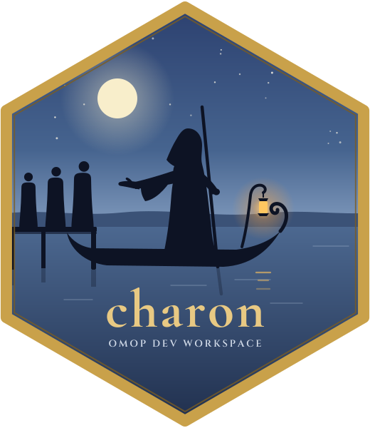
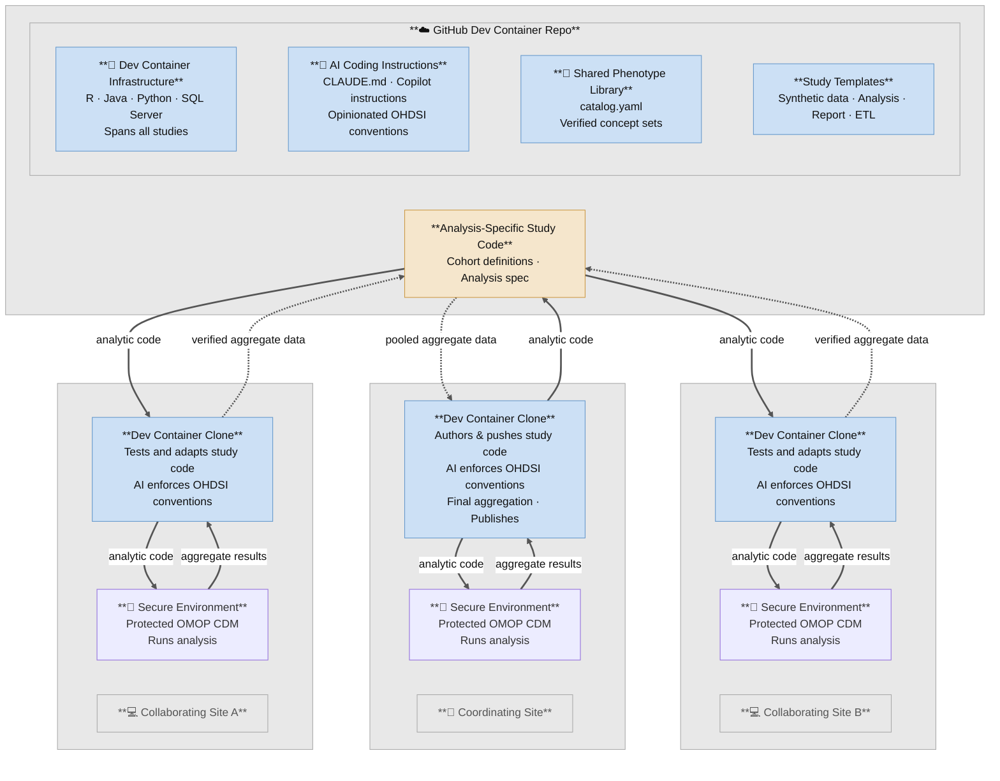

### charon 

**C**ontainerized **H**ADES **A**nalytics for **R**esearch in **O**HDSI **N**etworks.

[](https://doi.org/10.5281/zenodo.23189333)

charon is a **workspace template** for running observational studies on an
OMOP CDM v5.4 database with the OHDSI HADES R packages. It gives you, ready
to use:

- a **dev container** (R, Java and Python — versions you set to match your
  secure analytics environment) plus a **SQL Server** database in Docker, so
  every collaborator has an identical environment;
- a **shared phenotype library** — a catalog of concept sets that have already
  been verified against the vocabulary, so nobody re-derives them;
- a **registry of reusable synthetic datasets**, so a new study can develop
  against realistic fake patients without generating its own;
- **study templates** for generating analysis-specific synthetic data, building ETLs from existing non-OMOP data, running Strategus-based analyses, and generating reports from the aggregate outputs of those analyses;
- **AI-assistant rules** (`CLAUDE.md`, Copilot instructions) that enforce
  the lab's OHDSI conventions when an assistant writes code for you.

Fork the repo, or click **Use this template**, to stand up your own lab's
workspace.

> **Who this README is for.** It assumes you know the basics of OMOP and
> OHDSI (CDM tables, concept IDs, Athena, ATLAS, HADES), you can read R and
> Python, and you know roughly what Java is for (HADES uses it through JDBC).
> Every charon-specific
> term is defined the first time it appears, and again in the
> [glossary](#glossary).

**Contents:**
[What problem this solves](#what-problem-this-solves) (aggregate-first vs. federated, hypothesis-driven design) ·
[The big picture](#the-big-picture) ·
[Glossary](#glossary) ·
[What a study looks like](#what-a-study-looks-like) ·
[What is in this repo](#what-is-in-this-repo) ·
[Rules you must follow](#rules-you-must-follow) ·
[Prerequisites](#prerequisites) ·
[Where to go next](#where-to-go-next) ·
[Using charon for your own lab](#using-charon-for-your-own-lab)

---

## What problem this solves

### The usual approach: aggregate first, analyze second

Many people assume that observational health research has to work like this:
collect patient-level data from every participating institution into one
place, *then* analyze it. That approach is getting harder to sustain, because
of the volume and complexity of what today's EHRs capture:

- **Data use agreements.** Moving patient-level data between institutions
  triggers privacy, security and legal review at each one. Negotiating
  data use agreements (DUAs) can take months, and the work repeats for every
  new study, partner or data element.
- **Stripped-down data.** To make sharing tolerable, data is de-identified or
  abstracted down to a limited extract. Exact dates, free-text-derived
  features, detailed medication and lab histories, and linkage across
  encounters are often the first things lost, taking much of the analytic
  richness of the EHR with them.
- **Bottlenecks.** Even within one institution, analyses typically queue
  behind a single data abstraction and analysis team that extracts a bespoke
  dataset for each question.

### The alternative: the code travels, the data stays put

charon supports **federated analysis**. Each institution keeps its data in
its own secure environment, converted to the OMOP common data model. The
analysis code is written once, shared, and executed *where the data lives*;
only **aggregate results** come back. This minimizes the administrative
burden of a study and still lets the analysis use the full richness of the
patient-level data in the EHR, because that data is never reduced before
analysis.

### It also opens up OMOP data inside a single institution

You do not need a multi-site network to benefit. Once an institution's EHR
data is in OMOP, **any trained individual there can draft and test an
analysis themselves** — against synthetic data in the dev container — and then
run the finished, reviewed code in the secure environment. That removes the
dependency on one data abstraction and analysis team for every study, while
the standardized vocabulary and shared definitions keep the results
comparable and reviewable.

### It makes the analysis hypothesis-driven

Because the code is written against synthetic data, **the analysis is
designed before anyone sees a real result**. The team can:

- build the cohorts and check that they behave sensibly;
- choose the analytic strategy (covariates, comparison method, outcome
  models, sensitivity analyses);
- build the publication-ready tables and figures, end to end.

Aside from data-quality checks, nothing about the real data informs these
choices. The finished code is committed and reviewed in git, then run once in
the secure environment. This follows the scientific method more honestly than
exploring the real data until something looks interesting: with no results to
peek at, there is little opportunity for the forking-paths and repeated
re-analysis that produce "p-hacking". The git history shows exactly what was
specified before the real run, and any change afterwards is a visible,
reviewable deviation rather than a silent one. (Study protocols can also be
hosted privately on OSF; see `osf/`.)

Synthetic data does not tell you what the real effect is, only that the
pipeline works and the plan is sound. The real run is still where data
quality is assessed, and findings from it should be reported as pre-specified
or as clearly labelled post-hoc deviations.

### What charon has to solve

Running code you cannot watch, against data you cannot see, creates four
practical problems, and charon is built around them:

1. **You need somewhere safe to write the code.** You cannot develop against
   real patients on a laptop. charon runs everything against *synthetic*
   OMOP data (generated with [Synthea](https://github.com/synthetichealth/synthea))
   inside a local container, so the shared GitHub repos never contain PHI.
2. **The code has to run somewhere you cannot see.** The secure environment
   at each site is often air-gapped. charon pins every R package in
   `renv.lock`, bundles the JDBC driver, and has each study build a
   self-contained *bundle* (code + pinned dependencies, no network calls) that
   can be carried across the boundary.
3. **Every result must be traceable.** Observational findings are only
   credible if you can show exactly what produced them. All study code,
   cohort definitions and concept sets live in git, changes reach `main`
   through reviewed pull requests, and package versions are pinned — so a
   result maps to one exact, rebuildable version of the code. (A short git and
   VS Code primer is in [`docs/GETTING_STARTED.md`](docs/GETTING_STARTED.md#primer-git-github-cloning-and-vs-code).)
4. **Everyone must use the same definitions.** Two analysts looking up
   "heart failure" independently will pick different concept IDs. charon's
   phenotype library and its mandatory concept-lookup order
   ([Rule 1](#rules-you-must-follow)) prevent that.

Only **aggregate statistics** ever come back out of a secure environment.

## The big picture



How to read the diagram:

- **Top (GitHub).** Shared, PHI-free: the infrastructure in this repo, the
  study templates, the phenotype library, and each study's code.
- **Middle (each site's dev container).** A clone of the workspace on a
  developer's machine. Code is tested here against synthetic data.
- **Bottom of each column (secure environment).** The institution's real CDM.
  Code goes in; only aggregate results come out. The *coordinating site* is
  the one that authors the study and pools the aggregate results.

| Property | How it is achieved |
|---|---|
| No PHI in shared repos | Development and CI always use Synthea synthetic data |
| Reproducible environments | Dev container pinned by `.devcontainer/Dockerfile` and `renv.lock` |
| Portable to air-gapped sites | Each study builds a bundle of code + pinned dependencies with no live network dependency |
| Shared concept sets | `phenotype_library/catalog.yaml` distributes verified concept IDs |
| Shared synthetic datasets | `synthetic_data/registry.yaml` lets studies reuse a dataset without redistributing vocabulary |
| Multi-site synthesis | Sites return aggregates only; HADES `EvidenceSynthesis` combines them |

## Glossary

Terms specific to this project (standard OHDSI terms are not repeated).

| Term | Meaning |
|---|---|
| **Workspace** | This repo, cloned onto your machine. It owns the shared SQL Server, vocabulary, dev container, phenotype library, and AI rules. Study repos live *inside* the workspace folder but are separate git repos. |
| **Dev container** | A Docker container (defined in `.devcontainer/`) with R, Java, Python and all HADES packages installed. You open the workspace in VS Code and your terminal runs inside it. |
| **`omop_synth`** | The one SQL Server database all your local studies share. |
| **`omop_vocab`** | The schema inside `omop_synth` holding the OMOP vocabulary. Loaded once per machine from an Athena download; read by every study. |
| **Study repo** | A separate git repo for one piece of one study. Four kinds, below. |
| **Template** | A GitHub *template repository* you click **Use this template** on to create a study repo. The workspace includes the four templates as git submodules for reference. |
| **Bucket** | One of the four *kinds* of repo a study is split into (synth, analysis-core, report, site-deploy). |
| **Synth repo** (`<study>-synth`) | Generates one reusable, analysis-specific synthetic OMOP dataset with Synthea. Contains no analysis and never answers a research question. |
| **Analysis-core repo** (`<study>`) | Cohort definitions, analysis specification, and the code that turns CDM queries into result files. Must be safe to share with any institution. |
| **Report repo** (`<study>-report`) | Builds the manuscript (Word) from the analysis-core's result files only. Never connects to a database. |
| **Site-deploy repo** | Your institution's private glue that gets an analysis-core *bundle* running in your secure environment. Not templated. |
| **Bundle** | A self-contained package of study code plus pinned R packages and JDBC driver, built for transport into an air-gapped environment. |
| **Phenotype library** | `phenotype_library/`: a catalog of concept sets and cohort definitions verified in earlier studies. |
| **Lookup tiers** | The mandatory order for finding a concept ID: Tier 1a OHDSI Phenotype Library → Tier 1b your lab's labelled ATLAS definitions → Tier 2 local catalog → Tier 3 live vocabulary query. See [Rule 1](#rules-you-must-follow). |
| **`[vocab query]` / `[pretraining]`** | Provenance labels on every concept ID. `[vocab query]` = confirmed against your loaded vocabulary. `[pretraining]` = recalled from AI training data and **not trustworthy** until verified. |
| **Working branch** | Your personal git branch, named after your GitHub username. You never push to `main`. |
| **Strategus** | The HADES framework that runs a multi-module analysis from a single JSON specification. Used by the analysis-core template. |
| **circe** | The JSON format ATLAS uses for cohort definitions, rendered to SQL. |

## What a study looks like

A study is **not one repo**. It is split by *audience*, because code that
mixes deployment scripts, report formatting and cohort logic gets copied
between studies and drifts. Each repo is created from a template.

| # | Role | Repo name | Create it from | Holds |
|---|---|---|---|---|
| 1 | Synth | `<study>-synth` | [`synthea-omop-template`](https://github.com/Duke-Vascular-Informatics/synthea-omop-template) | **Data generation only.** An analysis-specific Synthea disease module, plus generation → ETL → quality-check steps (`workflow/01–06`) producing one reusable synthetic CDM. Registered in `synthetic_data/registry.yaml`. **Optional** — only if no existing dataset fits. Contains no analysis. |
| 2 | Analysis-core | `<study>` | [`strategus-study-template`](https://github.com/Duke-Vascular-Informatics/strategus-study-template) | circe cohort JSON, the Strategus analysis spec, the extract step that writes result CSVs. No report code, no PHI. |
| 3 | Report toolkit | `omop-report-toolkit` | — (one shared package) | Generic table/figure helpers used by every report repo. |
| 3b | Report | `<study>-report` | [`omop-report-template`](https://github.com/Duke-Vascular-Informatics/omop-report-template) | One study's manuscript: which tables, which figures, the narrative. Reads analysis-core output only. **Every study gets one**, even a purely descriptive one. |
| 4 | Site-deploy | `<your-site>-deploy` | — (private, institution-specific) | Turns the bundle into something your secure environment can run: site config, handoff mechanism, credentials. The only place PHI-adjacent exports or site credentials may live. |

A fifth template, [`omop-etl-template`](https://github.com/Duke-Vascular-Informatics/omop-etl-template),
is separate from the pipeline above: use it when you need to convert a *real*
registry or flat-file source into OMOP CDM v5.4.

**Where does the analysis live?** Always in the analysis-core repo built
from `strategus-study-template` (and the manuscript in the report repo).
`synthea-omop-template` is *only* a template for generating
analysis-specific synthetic data: it has no analysis, report or packaging
steps, and none should be added to a `-synth` repo. Its `cohorts/` and
`covariates/` folders exist solely so you can check that the generated data
actually contains the patients your study needs.

**Why the split is load-bearing.** The analysis-core repo is the thing you
hand to other institutions, so nothing site-specific or report-specific may
be in it. The report repo must run on a laptop with only a clone and a
`results/` folder — so it must never import `DatabaseConnector`. If you want
to add a query to a report repo, it belongs in the analysis-core's
`R/extract_report_inputs.R` instead.

`studies.yaml` is the registry of every repo in your workspace: which bucket
it occupies (`pipeline_role`) and how far it has migrated to this layout
(`migration`). Check it before assuming where a given piece of code lives.

### How the repos sit on disk

Study repos are cloned *inside* the workspace folder, as siblings:

```
my-workspace/                  ← this repo (infrastructure)
├── .env                       ← your secrets (gitignored)
├── omop_vocab/                ← Athena vocabulary CSVs (gitignored)
├── my-study/                  ← analysis-core repo (own git remote)
│   └── output/                ← result files; the report repo reads these
└── my-study-report/           ← report repo (sibling, never nested)
```

Study repos are not part of the workspace repo. List them in the workspace
`.gitignore` and register them in `studies.yaml`.

## What is in this repo

```
charon/
├── docker-compose.yml          # Shared SQL Server container (container name: mssql_dev)
├── .devcontainer/              # Dev container: Dockerfile, compose overlay, VS Code config
├── renv.lock                   # Workspace-wide R package lockfile (HADES + tidyverse)
├── .Rprofile                   # Activates renv; loads .env (real environment wins over .env)
├── .env.example                # Template for your secrets file
│
├── CLAUDE.md                   # Rules for AI assistants — read it, it applies to you too
├── .github/                    # Copilot instructions (same rules, Copilot format)
│
├── studies.yaml                # Registry of your study repos (placeholder content)
├── contributors.yaml           # Contributors and CRediT roles (placeholder)
├── WORKSPACE_ROSTER.md         # Your repos and repo-specific rules (placeholder)
│
├── docs/                       # Onboarding and reference docs — start at docs/GETTING_STARTED.md
├── infrastructure/             # One-time setup: vocabulary loader, host bootstrap scripts
├── scripts/                    # Workspace utilities + charon sync tooling
├── phenotype_library/          # Verified concept-set catalog + lookup scripts
├── synthetic_data/             # Synthetic dataset registry + export/import scripts
├── osf/                        # Registry and scripts for hosting protocols on OSF (private)
│
├── synthea-omop-template/      # submodule → bucket 1 (-synth repos; synthetic data generation only)
├── omop-etl-template/          # submodule → real-source-to-OMOP ETL
├── strategus-study-template/   # submodule → bucket 2 (analysis-core; all analysis)
└── omop-report-template/       # submodule → bucket 3b (report repo)
```

How the pieces fit at runtime:

| Layer | Lives in | Purpose |
|---|---|---|
| SQL Server (Azure SQL Edge, ARM64-native) | `docker-compose.yml` | One database server shared by every study on the machine |
| OMOP vocabulary | `omop_vocab/` on disk → `omop_vocab` schema | Loaded once; every study reads it |
| R + Java + Python | `.devcontainer/` | Same toolchain for everyone, **pinned to the versions your secure environment provides** (see below). Java is needed by `DatabaseConnector`/JDBC; a Python virtualenv (`/opt/mlenv`) is used to apply Python-based prediction models. |
| R packages | `renv.lock` | Full HADES + tidyverse, restored when the container builds |
| Study logic | Separate study repos | Cohorts, analysis spec, results |

When you open the workspace in VS Code's dev container, the SQL Server
container and the dev container start together on one Docker network. The dev
container reaches the database at host `mssql_dev` (set automatically as
`MSSQL_HOST`), not `localhost`.

### Match the toolchain to your secure environment

Your code is developed in the container but run in your institution's secure
analytics environment, so the two must use the same **R, Java and Python
versions**. The defaults (R 4.5.2, Java 17, Python 3.12) are those of the
environment charon was built for, not necessarily yours. **Before your first
build**, find your secure environment's versions and set `R_VERSION`,
`JAVA_VERSION` and `PYTHON_VERSION` in `.env`; the container then builds to
those. If you change R, reconcile `renv.lock` too. Full steps:
[`docs/GETTING_STARTED.md` → Step 6.0](docs/GETTING_STARTED.md#60-match-the-container-to-your-secure-environment-before-the-first-build).

### Shared R packages: two-level renv

| Level | File | Holds |
|---|---|---|
| Workspace | `renv.lock` at the workspace root | Everything shared: HADES, tidyverse, reporting packages, database/ETL packages |
| Study repo | `<study>/renv.lock` | Only packages that study needs *beyond* the workspace lockfile — usually nothing |

If a package is already in the workspace lockfile, do not add it to a study's.
If a study needs a new reusable package, add it at the workspace level first
(a PR here with `renv::install()` + `renv::snapshot()` run from the workspace
root).

## Rules you must follow

These are enforced for AI assistants by `CLAUDE.md` and apply equally to
humans. Read `CLAUDE.md` in full before your first change.

1. **Rule 1 — Concept-ID transparency.** Never write a concept ID into code,
   SQL or a CSV until you have checked, *in order*: (1a) the OHDSI Phenotype
   Library, (1b) your lab's label-prefixed ATLAS cohorts/concept sets
   (authoritative — a local definition should converge to them), (2) the
   local `phenotype_library/catalog.yaml`, and only then (3) a live vocabulary
   query. Label every ID `[vocab query]` or `[pretraining]`; only the former
   may be committed. Concept IDs recalled from memory — including by an AI —
   have been wrong in this vocabulary build. After a Tier-3 lookup, add the
   result to the catalog so the next study skips it.
2. **Rule 2 — Package priority.** HADES packages first, tidyverse second,
   anything else only from the project's CRAN mirror. No `dbplyr`, `odbc`, or
   direct `DBI` — use `DatabaseConnector` and `SqlRender`.
3. **Rule 3 — Verbose comments, OHDSI style.** File headers, section banners,
   and a trailing comment on every hard-coded concept ID naming the concept
   and its provenance label.
4. **Branching.** Work on a personal branch named after your GitHub username;
   open PRs into `main`; squash-merge only. Never push to `main` or to
   someone else's branch.
5. **No PHI, no secrets.** Output only aggregate statistics. Never commit
   `.env`, `omop_vocab/`, or anything from a secure environment.
6. **OSF stays private.** Protocol projects on OSF are created private and are
   made public only by a person, manually, after team approval.

## Prerequisites

You need accounts and software before the first-time setup:

| What | Why |
|---|---|
| GitHub account | Hosts the repos; its username becomes your branch name |
| Git | Version control |
| Docker Desktop 4.x+ | Runs SQL Server and the dev container |
| The R, Java and Python versions of your secure analytics environment | The container must be built to match them (Step 6.0 of Getting Started) |
| VS Code + the *Dev Containers* extension | Opens the workspace inside the container |
| Athena account (free, athena.ohdsi.org) | Downloads the OMOP vocabulary |
| UMLS account (free, optional) | Only needed to rebuild CPT-4 codes |

Hardware: about **35 GB** of disk in use (vocabulary CSVs, loaded database,
image, R packages), with Docker's virtual-disk limit set to **60–80 GB** for
build-cache headroom; **16 GB RAM** for Docker (12 GB minimum — the vocabulary
load is killed silently below that). The Claude Code assistant installs itself
inside the container; you supply an Anthropic API key in `.env`.

## Where to go next

Follow these in order:

| Step | Read | You will |
|---|---|---|
| 1 | [`docs/GETTING_STARTED.md`](docs/GETTING_STARTED.md) | Install tools, build the container, load the vocabulary, create your first study repos |
| 2 | [`docs/ANALYST_PLAYBOOK.md`](docs/ANALYST_PLAYBOOK.md) | Learn the day-to-day loop and where to look when something breaks |
| 3 | [`docs/COMMANDS.md`](docs/COMMANDS.md) | Keep as the command cheat sheet |
| 4 | [`phenotype_library/README.md`](phenotype_library/README.md) | Learn the concept lookup workflow before defining cohorts |
| 5 | The README of the template for the repo you are creating | Learn that template's own steps |

Other references: [`docs/SETUP.md`](docs/SETUP.md) (infrastructure details),
[`docs/GIT_GITHUB_AUTH.md`](docs/GIT_GITHUB_AUTH.md) (SSH/token auth),
[`synthetic_data/README.md`](synthetic_data/README.md) (reusing synthetic
datasets), [`docs/MAINTAINER_PLAYBOOK.md`](docs/MAINTAINER_PLAYBOOK.md)
(governance, if you maintain the workspace).

## Using charon for your own lab

Click **Use this template** (or clone), then replace the placeholder instance
data — every file already exists under its real name with one illustrative
entry and inline schema comments:

- `studies.yaml` — your study/report/synth/ETL repo registry
- `contributors.yaml` — your contributors (regenerate `CONTRIBUTORS.md` with `Rscript scripts/sync_contributors.R`)
- `phenotype_library/catalog.yaml` — your verified concept sets
- `osf/osf_projects.csv`, `osf/osf_files.csv` — your OSF protocol registry
- `synthetic_data/registry.yaml` — your synthetic dataset registry
- `WORKSPACE_ROSTER.md` — your repo layout and repo-specific rules
- `CITATION.cff` — your authors and repo URL

Everything else — `scripts/`, the lookup scripts, the four template
submodules, the dev container, and the generic rules in `CLAUDE.md` — is
infrastructure; keep it as is.

### Staying in sync with charon

To keep receiving infrastructure fixes after you diverge, add this repo as a
second remote and use the sync scripts. No shared git history is required:

```bash
git remote add charon https://github.com/Duke-Vascular-Informatics/charon.git
scripts/pull_charon_updates.sh                  # bring charon's infra fixes into your workspace
scripts/push_charon_updates.sh -m "<message>"   # contribute a fix back upstream
```

Both read `scripts/charon_manifest.txt` for the shared paths. Your lab's own
data (`studies.yaml`, `contributors.yaml`, the catalog, the roster, the OSF
registries) is excluded and never touched. Contributing guidelines are in
[`docs/MAINTAINER_PLAYBOOK.md`](docs/MAINTAINER_PLAYBOOK.md).

---

## Citing

If you use charon, please cite it — see [`CITATION.cff`](CITATION.cff) (GitHub's
**Cite this repository** button reads it). The DOI badge above,
[10.5281/zenodo.23189333](https://doi.org/10.5281/zenodo.23189333), always
resolves to the latest release; each release also has its own version DOI on
[Zenodo](https://doi.org/10.5281/zenodo.23189333), which is the one to cite when
reproducibility of a specific version matters (v1.0.0:
[10.5281/zenodo.23189334](https://doi.org/10.5281/zenodo.23189334)).

---

## Funding

The original development of this codebase (as this lab's own workspace,
before it was split into this reusable template) was supported by the
National Center For Advancing Translational Sciences of the National
Institutes of Health under Award Number K12TR005435. The content is solely
the responsibility of the authors and does not necessarily represent the
official views of the National Institutes of Health.

---

## License

Copyright 2026 Duke University. All Rights Reserved. The software is hereby licensed under the GNU GPL License v2 (see [LICENSE](LICENSE)). Study repositories and templates built from this workspace are likewise encouraged to license under GNU GPL v2. OMOP vocabulary files are subject to the [Athena license terms](https://www.ohdsi.org/analytic-tools/athena-standardized-vocabularies/).

This workspace's development and CI environments depend on
[Synthea](https://github.com/synthetichealth/synthea) (Copyright 2017-2025 The MITRE
Corporation) to generate synthetic patient data with no PHI. Synthea is an independently
developed, open-source project distributed under its own **Apache License 2.0** — a
separate license from this workspace's GPL v2, not a GPL v2 dependency. It is vendored,
with its own `LICENSE` and `NOTICE` preserved unmodified, in
`synthea-omop-template/external/synthea/`. Synthea is not affiliated with Duke
University; see the upstream project for its own terms, attribution requirements, and
citation.

### Third-party vocabulary content

The OMOP Standardized Vocabularies (loaded into a shared `omop_vocab` schema via
OHDSI Athena, per the [Athena license terms](https://www.ohdsi.org/analytic-tools/athena-standardized-vocabularies/)
above) bundle several independently owned terminologies. **No vocabulary data file is
ever distributed with this code** — each user obtains their own Athena download and
loads it locally (see `docs/SETUP.md`); repos here only reference individual
concept IDs, codes, and names.

- **SNOMED CT** — source vocabulary for most condition/procedure concepts. Maintained
  by [SNOMED International](https://www.snomed.org/snomed-ct/get-snomed-ct); use
  requires an affiliate license (satisfied in the US via the National Library of
  Medicine's national affiliate license).
- **LOINC** — used for lab values and functional-status/frailty assessment items.
  Maintained by Regenstrief Institute, Inc. and the LOINC Committee. LOINC's license
  requires including this notice wherever LOINC content is incorporated: *"This
  material contains content from LOINC (http://loinc.org). LOINC is copyright ©
  Regenstrief Institute, Inc. and the Logical Observation Identifiers Names and Codes
  (LOINC) Committee and is available at no cost under the license at
  http://loinc.org/license. LOINC® is a registered United States trademark of
  Regenstrief Institute, Inc."*
- **RxNorm** — used for medications. Maintained by the National Library of Medicine;
  public domain.
- **ATC** (Anatomical Therapeutic Chemical Classification) — used for drug
  classification. Maintained by the WHO Collaborating Centre for Drug Statistics
  Methodology.
- **CPT4 / HCPCS** — used for procedure concepts in some cohort definitions. CPT4 is
  proprietary, maintained by the American Medical Association; HCPCS Level II is
  maintained by CMS. If your studies use CPT4/HCPCS-coded procedures, document that
  reliance in your own workspace's README/NOTICE, the way a downstream repo built on
  this template would.

> This section is a practical summary, not legal advice. For legal interpretation,
> consult your organization's counsel.

---

## Acknowledgments

- The four template submodules this repo scaffolds from —
  `synthea-omop-template`, `omop-etl-template`, `strategus-study-template`,
  `omop-report-template` — and the broader [OHDSI](https://www.ohdsi.org/)
  / [HADES](https://ohdsi.github.io/Hades/) ecosystem this workspace builds on.

### Early testers

Thanks to the following people for early testing and feedback that shaped
charon, ahead of its public release — they did not contribute code directly,
but their input improved the software:

Ayman Ali, Sasank Kalipatnapu, Shoaib Siddiqui, Junette Yu, Kyle Ge,
Evan Minty, Leila Mureebe, Logan Couce.
